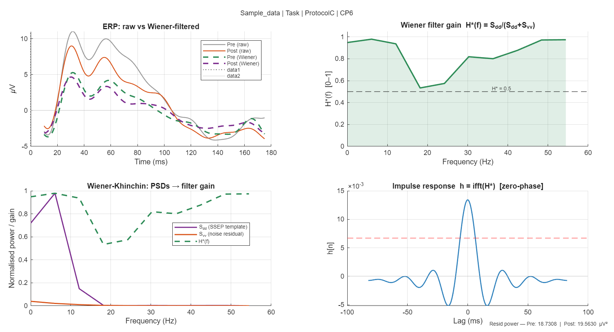

# Wiener filter design for SSEP analysis 

## Overview

This document captures the design rationale, implementation decisions, pitfalls encountered, and fixes applied when building a frequency-domain Wiener filter for somatosensory evoked potential (SSEP) analysis. It is intended as a reference for future development and for anyone replicating the pipeline.

---

## 1. Theory recap

### The Wiener filter in one line

The optimal linear filter that minimises mean squared error between a desired signal $d[n]$ and a noisy observation $x[n]$ is:

$$H^*(f) = \frac{S_{dd}(f)}{S_{dd}(f) + S_{vv}(f)}$$

where $S_{dd}$ is the power spectral density of the signal and $S_{vv}$ is the PSD of the noise. This is the **Wiener-Khinchin** form: the filter gain at each frequency equals the signal-to-noise ratio normalised to [0, 1].

- Where signal dominates: $H^* \to 1$ — pass through unchanged
- Where noise dominates: $H^* \to 0$ — suppress
- The filter is data-driven: its shape is determined entirely by the spectral content of your data

### Why this suits SSEP

SSEPs are phase-locked to the stimulus and repeat across trials. The cross-trial average is a clean estimate of the deterministic SSEP template. Trial-to-trial residuals are dominated by ongoing EEG noise (alpha, beta, drift). The Wiener filter exploits exactly this structure.

### The Wiener-Hopf equation (time domain equivalent)

$$\mathbf{R}_{xx}\,\mathbf{h}^* = \mathbf{r}_{dx}$$

Working in the frequency domain avoids solving this linear system explicitly and is $O(T \log T)$ via the FFT rather than $O(M^3)$ for matrix inversion.

---

## 2. Pipeline design

### Steps

```
1. Template d[n]    = nanmean(LB, 2)          [T×1]   SSEP estimate
2. Residuals V      = LB − d                  [T×N]   noise estimate
3. Shared Hann win  = hann(T)                 [T×1]   same for both PSDs
4. Sdd              = |FFT(d .* win)|² / scale        SSEP PSD
5. Sdd              = Sdd * N                          scale to per-trial power
6. Svv              = mean over trials of |FFT(v .* win)|² / scale
7. H_raw            = Sdd ./ (Sdd + Svv + eps)        Wiener gain
8. H_smooth         = Gaussian smooth of H_raw         stabilise ratio
9. taper            = cosine rolloff at band edges     remove ringing
10. H               = H_smooth .* taper                final gain
11. h               = real(ifft(H))                    impulse response
```

| Variable | Shape | Description |
|---|---|---|
| `LB` | `[T × N]` | Local pre trials — T time samples (rows), N trials (columns) |

### Applying the filter

```matlab
X_fft  = fft(X_clean, [], 1);      % FFT along time dimension
Y_fft  = X_fft .* H;               % element-wise multiply (broadcast)
Y_time = real(ifft(Y_fft, [], 1)); % back to time domain
```

Multiplying in the frequency domain is equivalent to circular convolution with `h = ifft(H)` (Convolution Theorem). For short epochs with a smooth H, circular convolution is a safe approximation.

---

## 3. Some learnings

### Pitfall 1 — Epoch too long, signal diluted

Initially, the filter was estimated over the full −300 to +700 ms epoch (~1000 ms). The SSEP (N20/P35 complex) occupies only the first ~80 ms. For the remaining ms, `d[n]` is near zero. The periodogram of `d` was therefore tiny relative to `S_vv` (broadband EEG noise present throughout the full epoch), making `H* ≈ 0` everywhere.

**Symptom:** H*(f) never exceeded 0.1 anywhere. Filtered ERPs were flat at zero.

**Fix:** Trim to the SSEP-relevant window before calling the filter:
```matlab
t_win = EEG.times >= 10 & EEG.times <= 125;   % ms
LB_ssep = LB(t_win, :);
PS_ssep = PS(t_win, :);
[H_w, h_w, Sdd, Svv, f_axis] = compute_wiener_filter(LB_ssep, Fs);
```

**Rule:** The epoch passed to the Wiener filter should be restricted to the time window where signal actually exists. 

---

### Pitfall 2 — Sdd not scaled to per-trial power

 `S_dd` is the PSD of the cross-trial average `d = mean(LB, 2)`. Averaging N trials reduces the amplitude of the incoherent noise by $1/\sqrt{N}$ and the power by $1/N$. So `S_dd` is N times smaller than the per-trial signal power. Meanwhile `S_vv` is estimated per trial and averaged — it is on the per-trial scale. The ratio `S_dd / (S_dd + S_vv)` was therefore always near zero.

**Symptom:** H*(f) near 0 everywhere even after epoch trimming. Both PSDs appeared tiny in the diagnostic plot.

**Fix:**
```matlab
Sdd = (abs(fft(d .* win)).^2) / scale;
Sdd = Sdd * N;   % restore per-trial scale
```

**Rule:** `S_dd` must be scaled up by N to be comparable to the per-trial `S_vv`. Without this the SNR estimate is always artificially low by a factor of N.

---

### Pitfall 3 — Normalisation mismatch between Sdd and Svv

`S_dd` used one normalisation (no Hann window, divide by T) and `S_vv` used another (Hann window, divide by `T * win_norm`). Even though the scale cancels in the ratio, the mismatch changed the effective relative magnitudes, artificially suppressing `S_dd` relative to `S_vv`.

**Symptom:** H* driven to 1 at high frequencies where both PSDs were near zero, because `eps` dominated the denominator — a numerical artefact, not a real filter.

**Fix:** Use the same window and the same scale for both:
```matlab
win   = hann(T);
scale = sum(win.^2);   % identical for both

D   = fft(d .* win);
Sdd = (abs(D).^2) / scale;   % consistent

V_n = fft(v_n .* win);
Svv = Svv + (abs(V_n).^2) / scale;   % same scale
```

**Rule:** The scale cancels in the ratio, so absolute units don't matter. But relative normalisation does. Use the same window and divisor for `S_dd` and `S_vv`.

---

### Pitfall 4 — Gibbs ringing from the preprocessing brick wall

The preprocessing applied a 50 Hz lowpass, so H(f) drops abruptly to zero at 50 Hz. The `ifft` of a sharp step in frequency is a sinc — infinite ringing in time. This appeared as a 20 ms period sinusoid spanning the full ±60 ms impulse response window (period = 1/50 Hz = 20 ms).

**Symptom:** Panel 4 (impulse response) showed a wide sinusoidal oscillation. Filtered ERPs had artefactual ringing that obscured the N20/P35 complex.

**Fix:** Apply a cosine taper to smooth H to zero before the cutoff:
```matlab
f_high_start = 35;   % Hz — begin rolloff
f_high_zero  = 50;   % Hz — reach zero (matches preprocessing cutoff)

idx_hi = f_axis >= f_high_start & f_axis <= f_high_zero;
taper(idx_hi) = 0.5 * (1 + cos(pi * ...
    (f_axis(idx_hi) - f_high_start) / (f_high_zero - f_high_start)));
```

The formula gives taper = 1 at 35 Hz, 0.5 at 42 Hz, and 0 at 50 Hz — a smooth S-curve with no discontinuity.

**Rule:** Never let H drop abruptly to zero at the band edge. Always apply a smooth taper (cosine, Tukey, or Gaussian) over a transition zone of at least 10–15 Hz.

---

### Pitfall 5 — Taper not mirrored to negative frequencies
 The cosine taper was applied only to the positive frequency side (35–50 Hz). The FFT spectrum repeats after Fs/2 — the bins from Fs−50 to Fs−35 Hz are the negative-frequency mirror of the 35–50 Hz rolloff. Without mirroring, H had a smooth rolloff on the positive side but a hard jump on the negative side, breaking conjugate symmetry.

**Consequence:** `ifft(H)` had a non-zero imaginary part. Taking `real(ifft(H))` discarded the imaginary part incorrectly, producing an asymmetric impulse response (left lobe ≠ right lobe).

**Fix:** Mirror the taper to both sides of the spectrum:
```matlab
% positive side: 35 → 50 Hz (taper down)
idx_hi = f_axis >= f_high_start & f_axis <= f_high_zero;
taper(idx_hi) = 0.5 * (1 + cos(pi * ...
    (f_axis(idx_hi) - f_high_start) / (f_high_zero - f_high_start)));

% hard zero in the middle
idx_zero = f_axis > f_high_zero & f_axis < (Fs - f_high_zero);
taper(idx_zero) = 0;

% negative side: Fs−50 → Fs−35 Hz (taper up — mirror)
idx_neg = f_axis >= (Fs - f_high_zero) & f_axis <= (Fs - f_high_start);
taper(idx_neg) = 0.5 * (1 + cos(pi * ...
    ((Fs - f_axis(idx_neg)) - f_high_start) / (f_high_zero - f_high_start)));
```

**Rule:** Any modification to H on the positive frequency side must be mirrored symmetrically on the negative frequency side. The FFT of a real signal satisfies `H[k] = conj(H[T-k])`. Violating this makes `ifft(H)` complex.

---

## 4. Constraints imposed by preprocessing

This dataset was preprocessed with a **1–50 Hz bandpass** before epoching. This has two important consequences:

1. **The Wiener filter cannot recover frequencies above 50 Hz.** The N20/P35 complex has energy up to ~150 Hz in wideband recordings. After a 50 Hz lowpass, only the slow envelope of the SSEP survives. The filter operates on this broadened shape, not the sharp N20 peak.

2. **The useful frequency resolution is limited.** With a short epoch (~115 ms) and a 50 Hz bandwidth, you have roughly `50 / (Fs/T)` ≈ 6–12 meaningful frequency bins. Smoothing the ratio H is essential to avoid noise in the gain estimate from so few bins.

**Implication for metrics:** Peak amplitude and latency of the N20 are less precise than in wideband recordings. Area under the curve of the N20/P35 window (15–45 ms) is a more robust metric in this bandwidth.

**Implication for the filter shape:** A correctly working filter on this data should show H*(f) with a dome shape peaking in the SSEP band. If H*(f) is monotonically increasing (high-pass shape), the filter is being driven by noise statistics rather than signal content — a sign that either the epoch is too long or `S_dd` is not scaled correctly.

---

## 5. Diagnostic checklist

After each run, inspect the four panels. For each panel the table below describes the ideal outcome (what you would see with a perfect SSEP, good SNR, and a correct filter), what you actually want to see given the constraints of this dataset (1–50 Hz preprocessing, short epoch, low single-trial SNR), and the red flags that indicate something is wrong.



### Panel 1 — ERP waveforms

| | Description |
|---|---|
| **Ideal outcome** | Wiener-filtered ERP is nearly identical to the raw ERP in the N20/P35 window (10–60 ms) — the filter passes signal unchanged where SNR is high. Outside the SSEP window (60 ms onward) the filtered ERP is noticeably smoother and smaller than the raw, because the filter correctly attenuates noise-dominated late components. pre and post filtered ERPs are clearly separable, with any task-induced amplitude or latency change preserved or even enhanced relative to the raw comparison. |
| **Acceptable for this dataset** | Filtered ERPs are attenuated relative to raw by 20–40% (expected given H* < 1 across the band). The morphology is preserved — peaks at the same latencies, same polarity, no new oscillations introduced. The relative difference between pre and post is consistent between raw and filtered versions. |
| **Red flags** | Filtered ERP is flat or near zero. Filtered ERP is inverted. New oscillatory components appear that are not in the raw. pre and post filtered ERPs converge to the same waveform when the raw versions differ — the filter is erasing the effect. |

---

### Panel 2 — Wiener filter gain H*(f)

| | Description |
|---|---|
| **Ideal outcome** | H*(f) has a clear dome or bandpass shape — rising from near zero at DC (after the low-frequency taper), reaching values close to 1.0 in the SSEP frequency band (roughly 5–40 Hz for this dataset), then smoothly rolling off to zero toward 50 Hz via the cosine taper. The H* = 0.5 line is crossed on the way up and again on the way down, confirming that there is a genuine frequency band where signal power exceeds noise power. The shape is smooth — no erratic jumps between adjacent bins. |
| **Acceptable for this dataset** | H*(f) stays above 0.5 across most of the band, even if it does not reach 1.0 everywhere. A dip at 15–20 Hz (sensorimotor beta noise) is acceptable and physiologically expected. The gain should be data-driven in appearance — not monotonically increasing (that indicates the filter is tracking noise shape rather than SNR) and not flat at 1.0 everywhere (that indicates both PSDs are near zero and eps is dominating). |
| **Red flags** | H*(f) is monotonically increasing from left to right — this is a high-pass shape driven by S_vv falling faster than S_dd, not by genuine signal. H*(f) is flat at 1.0 everywhere — both PSDs are near zero and the ratio is 0/eps ≈ 0 or driven by smoothing artefact. H*(f) is erratic with large jumps between adjacent bins — PSD estimates are too noisy; increase smoothing or use more pre trials. H*(f) never crosses 0.5 — signal power is always below noise power; the filter has no meaningful operating band. |

---

### Panel 3 — PSDs (Wiener-Khinchin diagnostic)

| | Description |
|---|---|
| **Ideal outcome** | S_dd (purple, SSEP template PSD) is clearly and visibly above S_vv (orange, noise residual PSD) in the SSEP frequency band. The crossover point — where S_dd and S_vv intersect — corresponds directly to the frequency where H*(f) crosses 0.5 in Panel 2. S_vv has the expected 1/f shape (higher at low frequencies, falling with increasing frequency). S_dd has a clear spectral peak in the SSEP band reflecting the dominant frequency content of the N20/P35 complex. Both curves are visible and clearly distinct. |
| **Acceptable for this dataset** | S_dd is above S_vv in the 0–15 Hz range (where the slow SSEP envelope lives after 50 Hz preprocessing). S_vv may have a local bump at 15–20 Hz (beta noise). Both curves are visible — even if S_vv is small, it should not be completely invisible. The crossover of S_dd and S_vv at ~15–18 Hz should correspond to the dip in H*(f) in Panel 2. |
| **Red flags** | Both S_dd and S_vv are invisible (both hugging zero) — normalisation is wrong or both PSDs are genuinely near zero; H* is then driven entirely by eps and smoothing. S_vv is always above S_dd at every frequency — genuine SNR < 1 everywhere; the filter will suppress everything. S_dd shows a flat line with no spectral structure — the template has no frequency content; check that epoch trimming is correct and the signal window actually contains the SSEP. |

---

### Panel 4 — Impulse response h[n] = ifft(H*)

| | Description |
|---|---|
| **Ideal outcome** | A single compact lobe centred exactly at lag 0, symmetric around zero (left side = right side — confirming zero phase and conjugate symmetry of H). The main lobe width is approximately 1/bandwidth — for a 5–40 Hz passband that is roughly 1/35 Hz ≈ 28 ms, so the lobe should be contained within ±15 ms. Side lobes are small (less than 10% of the main lobe amplitude) and decay rapidly. h[n] is effectively zero by ±30 ms. The half-amplitude dashed line sits below the main lobe peak, not above it. No sinusoidal oscillation spanning the full window. |
| **Acceptable for this dataset** | Main lobe centred at lag 0, symmetric, decaying to near zero by ±40–50 ms. Moderate side lobes at ±15–25 ms from the beta-band dip in H*(f) — these are expected and not indicative of a filter error. The lobe width reflects the effective bandwidth of the filter. Ringing period of ~20 ms (corresponding to the 18–20 Hz beta dip) is acceptable as long as side lobes are small relative to the main lobe. |
| **Red flags** | Sinusoidal oscillation spanning the full ±60–100 ms window with period ~20 ms — Gibbs ringing from a hard spectral edge; apply or extend the cosine taper. Asymmetric lobe (left side different from right side) — H is not conjugate-symmetric; check the negative-frequency mirror taper. Main lobe is a near-perfect delta spike with no wings — H is effectively flat (gain ≈ 1 everywhere); the filter is doing nothing. h[n] does not decay within the epoch window — the impulse response is too long; reduce filter bandwidth or check taper. |

---

### Residual power

| | Description |
|---|---|
| **Ideal outcome** | Post residual power is meaningfully different from pre residual power. A reduction in post residual would indicate that the post trials are more consistent (less noise, better phase locking) — possibly a task effect on neural synchrony. An increase would indicate more trial-to-trial variability post — also a potential effect. The direction depends on the hypothesis. |
| **Acceptable for this dataset** | A small difference (5–15%) between pre and post residuals, with the direction interpretable in the context of the protocol. Report both values; do not interpret in isolation for a single subject. |
| **Red flags** | pre and post residuals are identical — the filter is producing the same output regardless of condition; signal recovery has failed. Residual power is larger than the raw ERP amplitude squared — the filter is amplifying noise rather than suppressing it; check S_dd scaling and normalisation. |

---

## 6. Key parameters

| Parameter | Value | Rationale |
|---|---|---|
| Epoch window | 10–125 ms | SSEP-relevant window only; avoids diluting S_dd |
| Window function | Hann | Reduces spectral leakage; same for S_dd and S_vv |
| Sdd scaling | × N trials | Restores per-trial power after cross-trial averaging |
| Smoothing kernel | Gaussian, σ = 3 bins | Applied to ratio H directly; softer than movmean |
| Taper start | 35 Hz | 15 Hz transition zone before preprocessing cutoff |
| Taper end / hard zero | 50 Hz | Matches preprocessing bandpass |
| DC cutoff | 2 Hz | Removes residual drift |
| Mirror taper | Fs−50 to Fs−35 Hz | Restores conjugate symmetry of H |

---

## 7. What this filter cannot do

- **Handle non-stationary noise.** The filter is estimated from pre and applied to post. If noise statistics change (e.g. increased muscle artefact post-task), the filter is no longer optimal.
- **Distinguish Task effects from noise.** If post SNR drops to near zero, the filter output is shaped noise, not a filtered SSEP. Always check residual power and compare to pre.
- **Replace trial rejection.** Heavily artefacted trials should be removed before the filter is estimated. Including them raises S_vv artificially and suppresses the filter gain.

---

## 8. Dataset access

Please email me if you want to try this exercise on a sample dataset

## 9. Running the exercise

**Requirements:** MATLAB (Signal Processing Toolbox for `hann`) and [EEGLAB](https://sccn.ucsd.edu/eeglab/) on the path.

1. Request the sample dataset (`Sample_data_wiener.set` + `Sample_data_wiener.fdt`) — see [Dataset access](#8-dataset-access).
2. Put both files in a `Sample_data/` folder at the **repository root**, or change `data_dir` at the top of [wiener_filter_ssep.m](wiener_filter_ssep.m). The script finds the folder both when you run the whole file and when you run a selection with MATLAB's current folder set to the repository root.
3. Run the script. It produces the four-panel diagnostic figure shown in [Section 5](#5-diagnostic-checklist).
4. Use the diagnostic checklist to judge the result, then try changing the parameters in [Section 6](#6-key-parameters) (epoch window, smoothing σ, taper edges) and see how each panel responds.