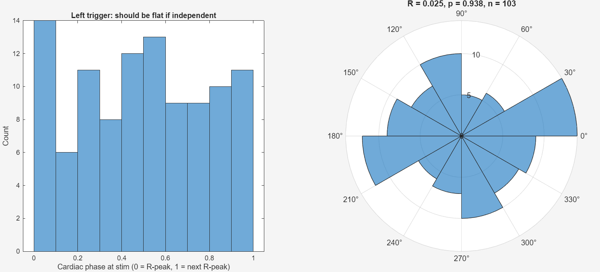
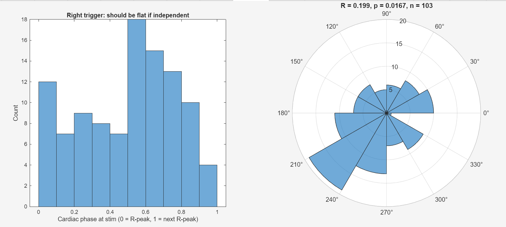
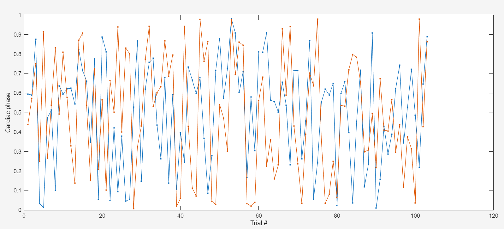
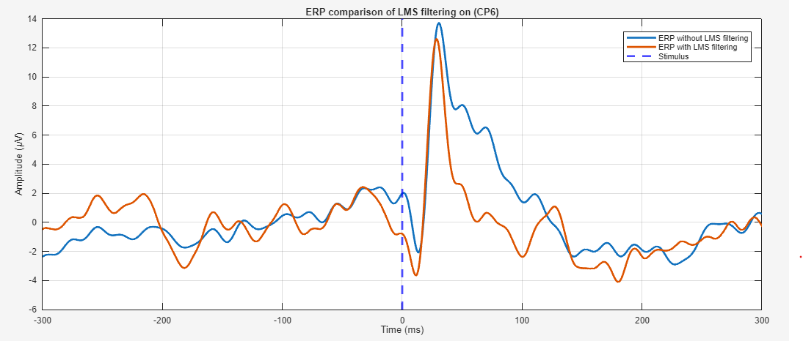
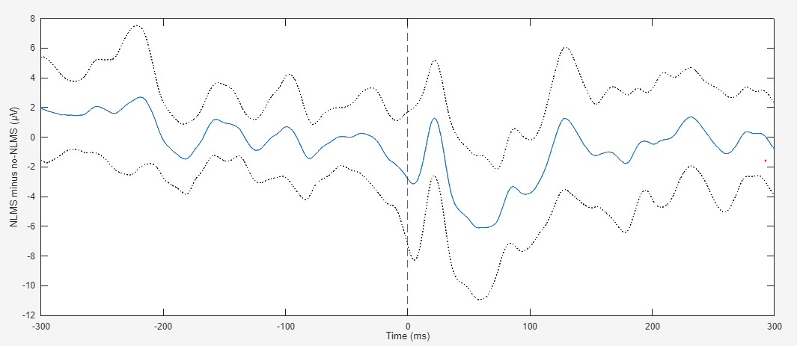
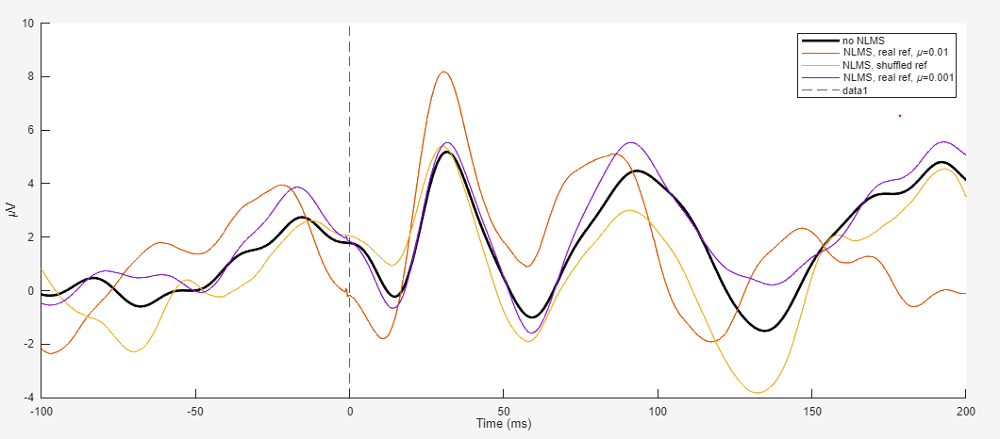

# EKG-NLMS Artifact Removal & R-Peak Phase-Locking Check

## Theory recap

**LMS as an extension of Wiener filtering.** LMS is stochastic gradient
descent on the same MSE cost surface that Wiener filtering solves in closed
form (`Rw* = p` → `w* = R⁻¹p`). Instead of computing `R = E[xxᵀ]` and
`p = E[dx]` up front, LMS walks downhill using a noisy, single-sample
estimate of the gradient at each step:

```
y[n] = wᵀx[n]
e[n] = d[n] - y[n]
w[n+1] = w[n] + μ·e[n]·x[n]
```

In expectation, `E[w[n]] → w*` — LMS is Wiener-filtering-by-approximation.
Geometrically, the cost `J(w) = E[e²]` is a quadratic bowl in weight space;
Wiener jumps straight to the bottom analytically, LMS takes noisy steps
downhill and circles the minimum rather than settling exactly on it
(misadjustment).

**Stability and μ.** Decomposing `R = QΛQᵀ` and rotating the weight-error
vector into this eigenbasis shows each component (**mode**) decaying
independently as `(1-μλᵢ)`. Convergence speed is bottlenecked by the
smallest eigenvalue; stability is threatened by the largest
(`μλ_max > 2` → divergence). Since `λ_max ≤ trace(R) = M·Pₓ`, the common
conservative bound for plain LMS is:

```
μ < 2 / (M · Pₓ)
```

**Two cardiac contamination pathways.**
- **Electrical QRS** — near-instantaneous volume conduction. Fast
  (~80–120 ms transient), and therefore broadband by Fourier duality (a
  sharp pulse in time ⇒ wide spread in frequency).
- **Ballistocardiographic (BCG)** — the *mechanical* consequence: a
  pressure/blood-volume pulse propagates through the vasculature and
  physically perturbs the scalp/electrode. Lags the R-peak by a variable
  ~150–250+ ms (finite propagation time), unlike instantaneous electrical
  coupling.

**Why fast transients couple in more than slow ones, independent of raw
amplitude** — both relevant leakage mechanisms favor high dV/dt:
- *Capacitive coupling*: `I = C·(dV/dt)` — amplitude doesn't appear in the
  equation, only rate of change.
- *CMRR roll-off*: amplifier common-mode rejection degrades at higher
  frequencies, and a fast transient's energy sits disproportionately at
  high frequency, right where rejection is weakest.

This is why the T-wave (slow, smooth) is treated as lower priority than QRS
(fast, sharp), as a physically motivated prior rather than something proven
for this dataset.

**Why phase-locking matters at all.** ERP averaging works because the
evoked response is locked to stimulus onset while unrelated noise is not.
Cardiac activity is normally unrelated to stim timing, so residual artifact
averages out like noise. If R-peaks were locked to stim (e.g. stim rate
close to a simple multiple of heart rate), residual artifact would add up
across trials like signal instead.

## Design of the filter

Scoped to the **electrical QRS component only**; BCG is not targeted
because it isn't clearly visible in this dataset.

| Parameter | Value used | Rationale |
|---|---|---|
| Filter memory | 100 ms | Spans the QRS complex only; electrical coupling is near-instantaneous, so no BCG-delay margin |
| Tap spacing | 2 samples (~0.5 ms at 4096 Hz), fixed in code | QRS is a fast, sharp transient and needs fine resolution; `TapSpacingMs` option is currently ignored |
| Algorithm | NLMS, μ = 0.01 | Step normalized by instantaneous reference energy (`‖x_n‖² + ε`) — handles EKG's highly non-stationary power (near-zero between beats, large during QRS) without hand-tuning a fixed μ |
| Reference pre-processing | None (`RefBandpassHz = []`); mean-removed only | The option exists (e.g. `[0.5 40]`, zero-phase) if slow drift in the raw EKG channel starves adaptation |
| Where it runs | Continuous data, after bandpass, **before** `pop_epoch` | Many heartbeats to converge over; avoids per-epoch re-adaptation noise |
| Reference blanking | −10 to +15 ms around each stim (linear interpolation), `BlankLatencies` / `BlankWindowMs` | Precaution against a stimulus marker in the reference. Tested: made no difference to the ERP, so it was not the cause (see QC section). The unblanked reference is kept as `ekg_ref_raw` for R-peak detection |

```matlab
w = w + (mu / (x_n'*x_n + epsilon)) * e(n) * x_n;   % NLMS update, vs. plain LMS's w + mu*e(n)*x_n
```

`e[n]` is the EKG-cleaned EEG — the part of the signal the reference cannot
explain — same convention as the original 50 Hz toy LMS demo.

## How to apply the filter

Script: [nlms_ekg_removal.m](nlms_ekg_removal.m).

1. Run `remove_ekg_nlms(EEG, EKG_chan{1}, selected_EEG_labels, 'FilterDurationMs', 100, 'TapSpacingMs', 2, 'Mu', 0.01)`
   on continuous data right after bandpassing, before `pop_epoch`.
2. Inspect `EKG_NLMS.<chan>.block_mse` (1 s blocks): should trend down over
   the first seconds and plateau. Flat from block 1 → μ too small; spiky or
   diverging → μ too large.
3. **Capture stim latencies and run the phase-locking check before
   `pop_epoch`.** After epoching, `EEG.event.latency` is re-indexed into the
   concatenated epoched data and no longer lines up with continuous R-peak
   times. The script saves continuous stim times in
   `EEG.stim_latency_cont_s` for later use.

### Phase-locking check procedure

1. **Sanity-check the timeline.** Print the median inter-stim interval and
   the last stim time against the recording duration. A clean ~1.000 s
   median (or a last stim at e.g. sample 840910 for ~206 epochs at
   fs = 4096) means epoched indices, and the check is invalid. Here:
   ~3.0 s median ISI, last stims at 328.8 / 330.4 s in a 340.9 s recording.
2. **Detect R-peaks** on a separate 5–25 Hz copy of the EKG reference
   (polarity forced positive, `MinPeakHeight = 3·std`,
   `MinPeakDistance = 0.4 s`). This does not touch the NLMS reference or
   the EEG data. Plot the first 20 s to confirm detection.
3. **Cardiac phase at each stim**, one-sided and using the local RR interval:
   `phase = (stim − previous R) / (next R − previous R)`, in [0, 1). Skip
   stims with no flanking R-peaks or a gap > 1.8 × median RR (missed beat).
4. **Rayleigh test**: `θ = 2π·phase`, `R = |mean(e^{iθ})|`, `z = n·R²`, and
   the Zar approximation `p = exp(√(1+4n+4(n²−(nR)²)) − (1+2n))`, valid at
   both small and large z.
5. **Plot** (a) phase histogram + polar histogram, and
   (b) **phase vs. trial number** for both sides. (b) is the most useful
   quick diagnostic: random scatter across 0–1 means near-independent
   trials; a zigzag between two bands that slowly slides would mean the
   stim rate and heart rate are beating against each other.


## Some learnings

1. LMS/NLMS mechanics map directly onto Wiener-filter intuition — same cost
   surface, approximate vs. closed-form solution; the eigenvalue spread of
   `R` governs both convergence speed and the stability bound on μ.
2. Coupling pathways (capacitive leakage, CMRR roll-off) both scale with
   dV/dt, not amplitude — physical grounding for deprioritizing the T-wave
   relative to QRS.
3. **A distance metric's structural bounds can fake a statistical result.**
   `min(abs(r_peak_times - t))` (nearest-in-either-direction) is bounded to
   `[0, RR/2]` by construction, so a circular test that assumes the full
   circle is reachable returned R = 0.606, p ≈ 3.5e-17 purely from this
   artifact. Use a one-sided offset (time since the previous R-peak), or
   phase relative to the local RR interval.
4. **Event latencies change meaning after `pop_epoch`.** They become indices
   into the concatenated epoched data (roughly (k−1)·pnts + time-zero
   offset). Comparing them with continuous R-peak times gave a meaningless
   R = 0.017. Always capture continuous stim times before epoching, and
   sanity-check the median inter-stim interval — an exact multiple of the
   epoch length is the tell.
5. **Effect size and significance answer different questions.** Always
   report R alongside p. With two sides tested, a Bonferroni threshold is
   0.05/2 = 0.025, not 0.05.
6. **Check independence of trials.** The Rayleigh test assumes independent
   draws. With ISI ≈ 3.0 s and RR ≈ 0.845 s the stim and heart rate are close
   to a simple ratio, which could in principle make phases deterministic
   trial to trial. The phase-vs-trial plot shows random scatter instead, so
   the test is usable here.

## Why is this an overkill

- Worth doing **once** as a targeted check on a specific concern (the
  electrical-only filter possibly missing a component that overlaps the
  0–80 ms window). It gave a bounded answer: left clean, right marginal.
- **Not needed as a default step in the main loop**:
  - Stimulus delivery and cardiac rhythm are physiologically independent in
    this protocol — no design reason to expect phase-locking, and the data
    here mostly confirm that.
  - The electrical-only NLMS filter already handles the dominant, fast-
    coupling QRS component.
  - Further splitting and testing (phase-group ERPs, p2p, baseline proxies)
    reads more into a small effect than the data support: it adds multiple
    comparisons on a single subject and p2p is noise-sensitive.
- **Proportionate routine check:** the capture-before-epoch block already in
  the pipeline prints R / p / n and draws the phase-vs-trial plot and the
  phase histogram. A glance at the plot (random scatter, no sliding bands)
  plus R and p is enough. Escalate to a phase-split analysis (ERPs grouped
  by cardiac phase at stim) only if R is large or the plot shows a clear
  beat pattern.
- If BCG contamination is ever suspected on visual grounds (artifact shape
  150–400 ms after the R-peak that a 100 ms filter can't explain), that is
  the trigger to revisit filter memory length.

## Output

Subject tested: recording 340.9 s, median RR 0.845 s, 104 stims per side,
n = 103 usable per side (one stim per side near the recording start is lost
to epoching / no preceding R-peak). Median ISI: 3.022 s (left), 2.951 s
(right).

| Side | R | z (≈ n·R²) | p (Rayleigh, Zar) |
|---|---|---|---|
| Left trigger | 0.025 | 0.06 | 0.94 |
| Right trigger | 0.199 | 4.1 | 0.017 |

**Left trigger:** phase histogram (left) and polar histogram (right).



**Right trigger:** phase histogram (left) and polar histogram (right).



**Cardiac phase vs. trial number** (blue = right trigger, orange = left
trigger). Random scatter across 0–1 with no slowly sliding bands means the
trials are close to independent.



**Conclusion: marginal pass.**
- Left trigger: no phase-locking (R = 0.025, p = 0.94).
- Right trigger: weak nominal clustering (R = 0.199, p = 0.017), just under
  the two-test Bonferroni threshold of 0.025. The phase-vs-trial plot shows
  no sliding or beating pattern, trials are close to independent, and the
  excess sits at phases where neither QRS nor T-wave falls in the 0–80 ms
  window. Judged small enough not to change the SSEP analysis; documented
  and moving on.
- The electrical-only NLMS filter (100 ms memory) is kept as is.


## QC of the NLMS effect on the ERP

**Question.** On CP6 (left trigger), the ERP with NLMS differs from the ERP
without it by several µV between ~30 and 100 ms, inside the SSEP window.
Is NLMS removing noise, or removing evoked signal?



Tests run, all on the same subject, CP6, left trigger (n = 103 stims):

| # | Test | What it asks | Result |
|---|---|---|---|
| 1 | Paired per-trial difference (NLMS − no-NLMS), mean ± 2 SEM | Is the change consistent across trials? | Difference of ~±6 µV at ~45–75 ms with the SEM band clear of zero. Note: the two runs had different trial counts (102 vs 103) and the second run was trimmed to its first 102 trials. The mean difference equals the difference of the two ERPs, so it is unaffected by pairing;Tests 3–5 below use the continuous data and are not affected. |
| 2 | Stim-locked average of the EKG reference, mean ± 2 SEM | Does the reference carry stim-locked content the filter could learn? | The band includes zero at every time point, including the narrow spike at 0 ms. No significant stim-locked content. |
| 2b | Blank the reference around each stim (−10 to +15 ms, linear interpolation) and rerun | Is a stimulus marker in the reference the cause? | The ERP difference and the weights plot were unchanged. Ruled out. R-peak detection uses the unblanked `ekg_ref_raw`, so R and p are unchanged too. |
| 3 | Final weights vs. lag, overlaid on the difference waveform | Do the weights form an SSEP template? | No. The weights are smooth and all positive (0.16 at 0 ms, ~0.05 by 10 ms, slowly rising to 0.08 at 100 ms) and do not mirror the difference. |
| 4 | Control runs: real reference μ = 0.01, shuffled reference (circular shift by 60 s), real reference μ = 0.001 | Does the change need the true EKG–EEG relationship? Does it depend on μ? | See table below. |
| 5 | Null test: 300 random sets of 103 pseudo-stim times, compare ERP RMS (0–100 ms) with and without NLMS, and the NLMS-minus-raw RMS at real vs random times | Is the change specific to the evoked response, and does NLMS lower the noise floor? | See below. |

**Test 1, paired per-trial difference** (NLMS minus no-NLMS, mean ± 2 SEM):



**Test 4, control runs:**



Approximate ERP values read off the plot (µV). These control runs filter
CP6 on its own, before Fz re-referencing and trial rejection, and average
every left stim, so the amplitudes differ from the pipeline ERP above.

| Run | Peak at ~30 ms | Trough at ~58 ms |
|---|---|---|
| No NLMS | 5.2 | −1.0 |
| Real ref, μ = 0.01 | 8.2 | +0.9 |
| Shuffled ref, μ = 0.01 | 5.4 | −1.9 |
| Real ref, μ = 0.001 | 5.5 | −1.6 |

- The 20–70 ms change needs the real reference (shuffled stays within ~1 µV
  of no-NLMS there).
- After ~90 ms the shuffled reference deviates as much as the real one, so
  that late-window difference is generic weight wander, not cardiac.
- μ = 0.001 stays close to the raw ERP, so the result depends strongly on μ.

**Test 5, null test:**
- Null ERP RMS (0–100 ms), no NLMS vs. NLMS: **4.92 → 2.30 µV** (means over
  300 draws; the 95th percentile of the differences was 21.85 µV, so a few
  outlier draws inflate the means and the medians are more reliable).
- NLMS-minus-raw RMS: **null median 2.16 µV vs. 2.10 µV at real stims.**
  The change at real stim times is no larger than at random times, so there
  is no sign that NLMS acts on the evoked response specifically.

### Conclusion

The 30–100 ms difference between the ERPs with and without NLMS is
attributed to NLMS removing noise (EKG coupling in the EEG) from the
103-trial average, not to removal of the evoked response. This is
supported by:
- The change needs the real EKG reference (shuffled reference does not
  reproduce it before ~70 ms).
- The change at real stims is the same size as at random times.
- NLMS cuts the noise floor of random-time averages by more than half,
  which strengthens the noise-removal reading: the unfiltered ERP is noisy
  at the same scale as the N20 peak.
- No stimulus marker in the reference, and no SSEP-shaped template in the
  weights.

**Status: provisional.**
- One channel (CP6), one subject, left trigger only.
- The preservation of the SSEP has not been tested directly. A synthetic
  injection test (add a known response at random times in the raw data, run
  NLMS, measure how much comes back) would do that.
- The result depends on μ (0.001 vs. 0.01 give different ERPs), so μ should
  be chosen from a sweep of the null-test noise floor, not by default.
- NLMS changes the N20 peak amplitude, and the direction depends on the
  analysis:
  - **Control runs** (CP6 with EKG referenced vs CP with no NLMS test 4):
    the peak is larger with NLMS, about 8.2 vs. 5.2 µV at μ = 0.01.
  - **Full pipeline** (CP6 re-referenced to Fz, after trial rejection): 40–100 ms bump is removed.
  - A likely reason they differ: NLMS also filters Fz, so after
    re-referencing, the pipeline ERP includes the change at Fz as well as
    at CP6.
  - Either way, amplitude comparisons across conditions must use the same
    filter settings for every condition.

### Next steps

1. Repeat tests 4 and 5 on more channels (e.g. C4, CP2, CP5, CP1) and on more
   subjects. Removal of EKG coupling from the EEG needs to hold there before
   NLMS is adopted pipeline-wide.
2. μ sweep (e.g. 0.0003, 0.001, 0.003, 0.01, 0.03): median null RMS and ERP
   overlays; choose a μ where the null RMS levels off and neighbouring μ
   give similar ERPs.
3. Synthetic injection test to confirm the SSEP survives the filter at the
   chosen μ.


## Running the exercise

**Requirements:** MATLAB with the Signal Processing Toolbox (`findpeaks`, `butter`, `filtfilt`), [EEGLAB](https://sccn.ucsd.edu/eeglab/), and the **CleanLine** EEGLAB plugin (`pop_cleanline`).

1. Email me for the sample dataset (`Sample_raw_data.set`).
2. From the repository root, run `setup_paths` to add the shared helpers in [utils/](../../utils/) to the MATLAB path.
3. Put the dataset in a `Sample_data/` folder at the **repository root** (the same folder as `setup_paths.m`), or change `data_dir` at the top of [nlms_ekg_removal.m](nlms_ekg_removal.m). The script finds it both when you run the whole file and when you run a selection with MATLAB's current folder set to the repository root. Data files are excluded by `.gitignore`, so they won't be committed.
4. Run the script one section at a time. Check the before/after EEG trace and the `block_mse` convergence plot before moving on to the phase-locking check.
5. **QC sections (end of the script):** these compare the pipeline with and without NLMS, so run the whole script twice: once with `use_nlms = true` and once with `use_nlms = false` (set at the top). Each run saves `Sample_raw_data_with_LMS.set` or `Sample_raw_data_without_LMS.set` in `Sample_data/processed_data_LMS/`. Until both files exist, the script stops before the QC sections and prints a message saying so.